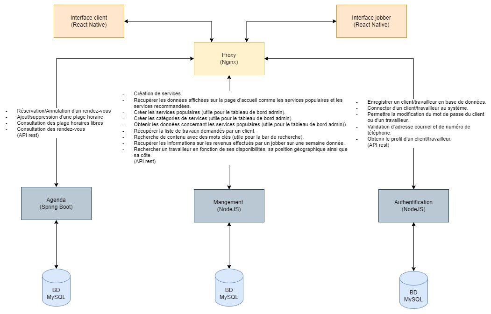
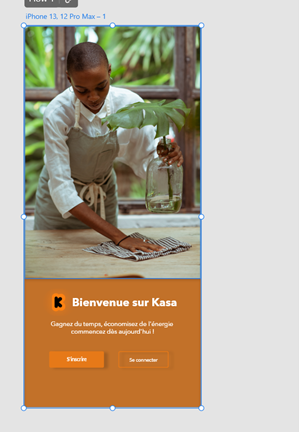
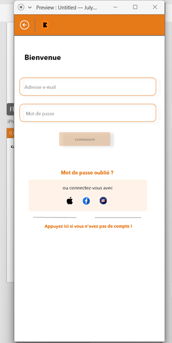
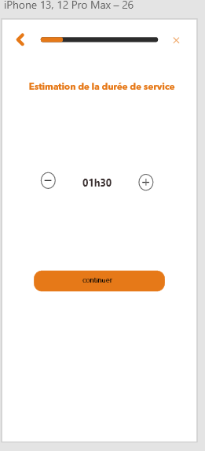
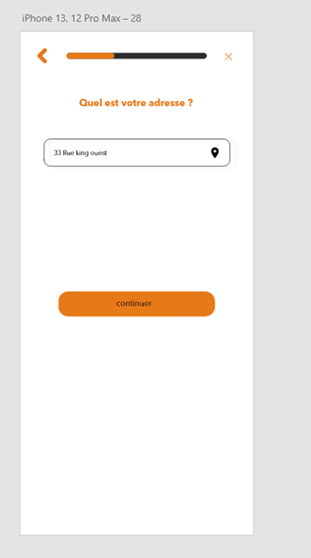
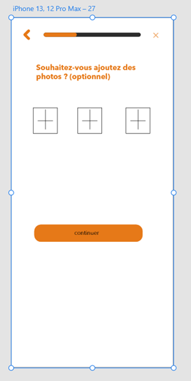
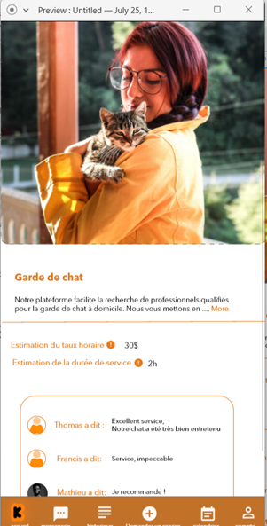

Kasa est une application mobile qui permet de connecter des travailleurs occasionnels avec des clients ayant besoin de différents services comme le déménagement, la réparation, le ménage à domicile, etc.

Vous pouvez consulter la **[vidéo promotionnelle](https://youtu.be/xvbEef3URqs)** du projet Kasa pour avoir plus de détails.

Cette application utilise **React Native** pour le front-end et les microservices développés en **Java (Spring Boot)** et **TypeScript (NodeJS)**. Voici l'architecture du projet:

Voici quelques images de l'application:

Ce dépôt Github contient seulement le microservice Management.

# management-service

pour runner le service veuillez:

- installer docker desktop

Après avoir installer docker desktop. A la racine du projet se trouve un dockerfile et un docker-compose qui permettent de runner la bd et le microservice.

Pour créer le conteneur a partir de l'image docker faire:

- docker-compose up -d --build

Le service et la bd devrait se lancer automatiquement et vous pouvez commencer à l'utiliser.

Note: Dans le dossier dbscript se trouve le script de création de la bd pour le service management. Si jamais vous avez à modifiez le schéma de la bd afin de faire une tâche, veuillez mettre a jour le script de bd.

Cela peut prendre quelque minutes a ce que le conteneur du service se connecte a la bd. Donc meme si les services roule dans docker, attendre 2 min environ avant de faire les requetes.
